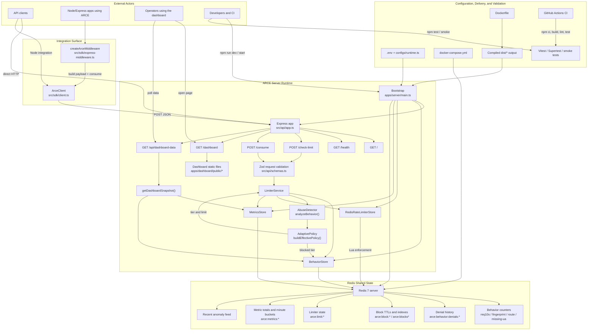
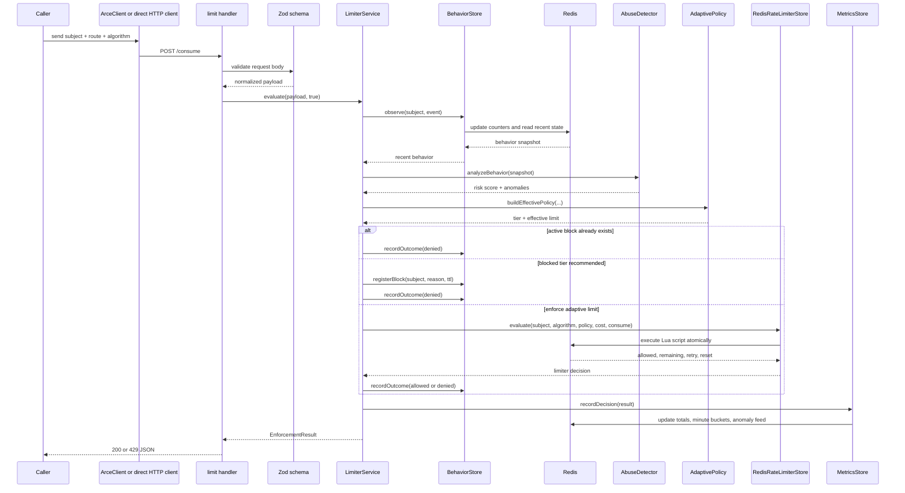
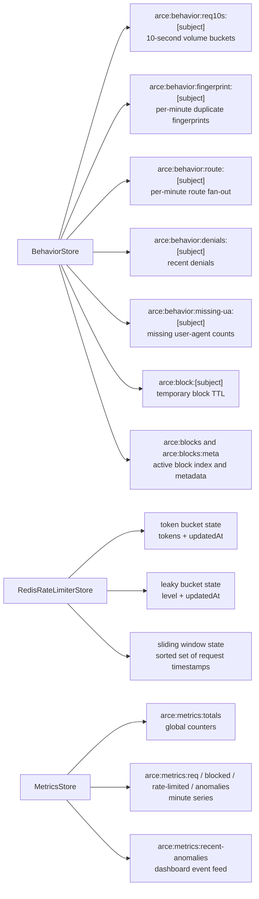
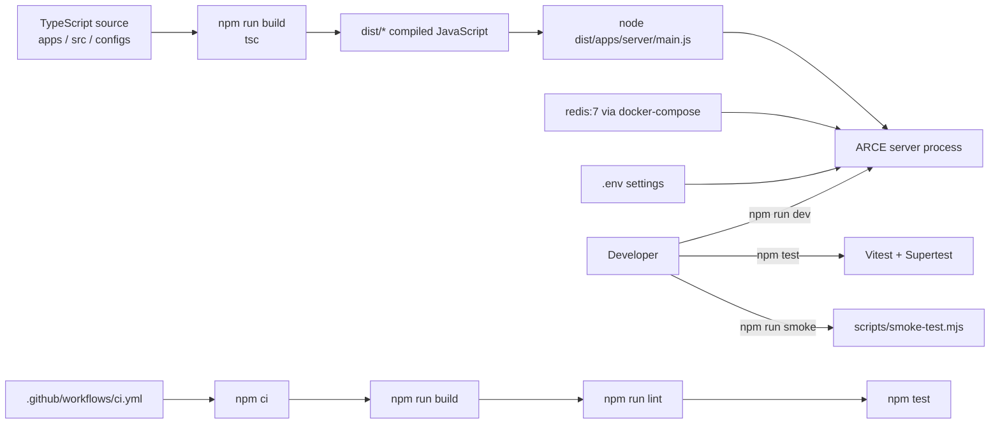

# ARCE System Diagram

This document translates the current codebase into diagrams that are useful for design reviews, demos, and onboarding.

It is based on the implementation in:

- `apps/server/main.ts`
- `src/api/*`
- `src/core/*`
- `src/store/*`
- `src/sdk/*`
- `apps/dashboard/public/*`
- `configs/*`
- `.github/workflows/ci.yml`

## 1. End-to-End System Overview

## 2. Request Lifecycle

This sequence shows the hot path for `POST /consume`.

## 3. Redis Responsibility Map

This diagram shows how Redis is partitioned by responsibility instead of treating every key as one blob of rate-limiter state.

## 4. Build, Run, and Verify Path

## Reading Guide

- Use diagram 1 when you need the full system picture.
- Use diagram 2 when you need to explain exactly how one rate-limit decision is produced.
- Use diagram 3 when you need to reason about Redis data ownership and lifecycle.
- Use diagram 4 when you need to explain developer workflow, packaging, and CI.
